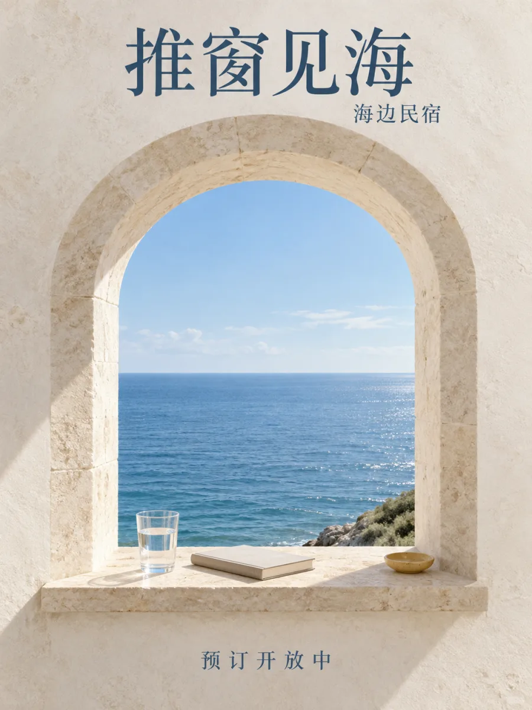
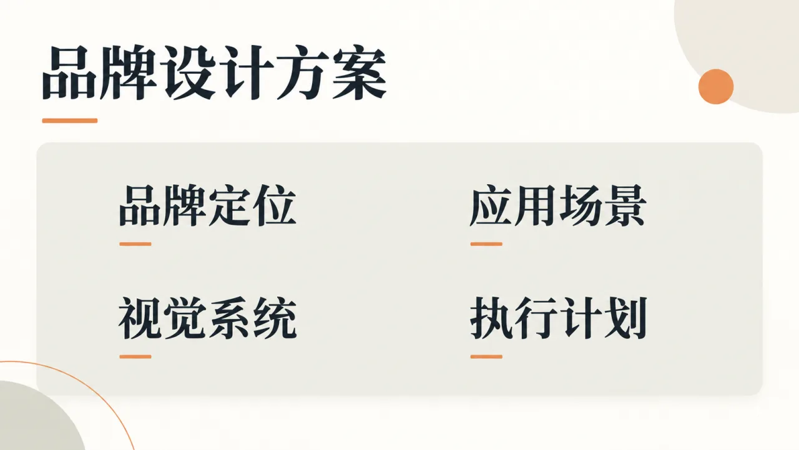
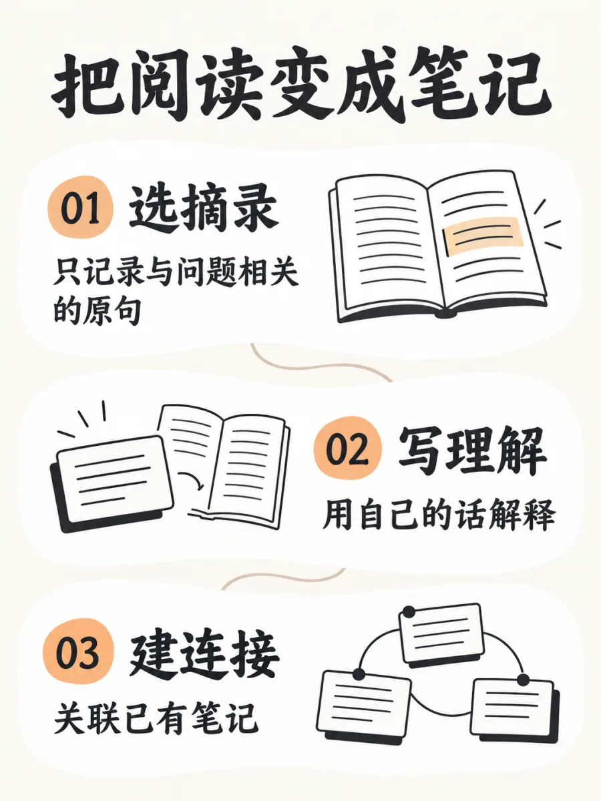

# ForestQ-codex-imagegen

用你自己的**中转站 API**（OpenAI 兼容接口）生图，并让 **Codex、Claude Code 以及任何 MCP 客户端**都能直接调用。

基于 [qiaomu-codex-imagegen](https://github.com/joeseesun/qiaomu-codex-imagegen)（向阳乔木，MIT）改造：原项目通过 `codex app-server` 借用 Codex 自带的生图能力，必须装好并登录 Codex CLI；这个版本把后端换成 HTTP 直连中转站，**不依赖 Codex CLI**，同时完整保留原项目的出图方法论——先给 ≥4 个风格方向、模板展开提示词、生成后按验收清单检查。

- 零依赖：Node.js 18.17+ 自带 `fetch`，不需要 `npm install`
- 三种入口：MCP server（stdio）、CLI、Agent Skill（`SKILL.md`）
- 两种接口格式，覆盖中转站常见的生图模型

| 接口格式 | 端点 | 适用模型（示例） |
|---|---|---|
| `images` | `/v1/images/generations`，有参考图时走 `/v1/images/edits` | gpt-image-1、dall-e-3、flux-*、seedream、imagen 等 |
| `chat` | `/v1/chat/completions`，参考图以 data URL 发送 | gemini-2.5-flash-image、nano-banana、gemini-3-pro-image-preview、gpt-4o-image、sora_image 等 |

`mode=auto`（默认）会按模型名自动选：名字含 gemini / banana / 4o-image / sora-image / `-all` 的走 chat，其余走 images。chat 返回的图片无论是 markdown 链接、data URL、`message.images[]` 还是 image parts 都能解析。

## 先给方案，再出图

对 Agent 说「给这期视频做一张封面」，它会先给方案，再调用你的中转站出图：

1. **推荐方向**：`suggest_directions` 给出至少四个机制不同的方向，覆盖文字主导、平面结构、摄影、产品近摄、材料空间和 Mondo 海报等家族，并列出每个方向需要补充的信息。
2. **选择方向**：你可以选一个、几个，或者说「你定」；想看更多时可以排除已有方向后再次推荐。
3. **展开提示词**：`compose_prompt` 把模板变量展开为完整提示词，同时给出避免项、验收条件、假设和缺失信息。
4. **调用中转站**：`generate_image` 按选定方向生成图片，并在旁边保存包含提示词、模型和后端域名的 JSON 旁注，方便复现。
5. **检查结果**：Agent 对照验收条件检查主体关系、比例、文字和参考图；失败时只修改对应关系再生成一次。

如果你已经指定了风格（例如「用 Mondo 风格」或「T03」），或者明确说「直接出」，会跳过选择步骤。整个流程不需要 Codex CLI，只使用你配置的 OpenAI 兼容中转站。

## 能做什么

| 你说 | 它做 |
| --- | --- |
| 给这期视频做一张 16:9 视频封面 | 使用 `video-cover` 预设，安排标题留白和安全区，返回文件路径与像素尺寸 |
| 做一张小红书配图，主题是清晨读书 | 使用 `xiaohongshu` 预设生成 3:4 竖版构图，保留顶部标题位 |
| 用 Mondo 风格做一张电影海报 | 从 20 位 Mondo 设计师风格中选择或并行生成多个方向 |
| 把这张图的背景换成米色纸，主体不变 | 通过 `reference_images` 或 CLI `--ref` 走图生图接口 |
| 公众号头图、X 封面、朋友圈海报、书籍或专辑封面 | 使用对应场景预设的比例和安全区规则 |
| 给我几个风格，帮我选一个 | 返回至少四个机制不同的方向，再按你的选择展开提示词 |
| 找以前类似的案例 | 在本地可选的参考提示词库中检索，不配置语料库也不影响其他功能 |

## 样例

下面的图片和提示词参数来自上游 [qiaomu-codex-imagegen](https://github.com/joeseesun/qiaomu-codex-imagegen) 的公开样例，用于展示本项目保留的模板机制和场景覆盖。图片由上游使用 Codex 生成，没有后期修图；活动、品牌、人物和文案全部是**虚构的示例**。完整提示词和参数见 [docs/samples/prompts.json](docs/samples/prompts.json)。当前项目可通过你配置的中转站 API，使用同一套模板重新生成或改图。

### 同一个主题，五个方向

主题都是「咖啡店阅读月」。`suggest_directions` 给出的方向机制完全不同，所以出来的不是同一张图换个滤镜：


| 方向 | 机制 |
| --- | --- |
| 1 · T01 巨字与微小叙事 | 大字是场景的墙，水边的小读者提供尺度 |
| 2 · T02 物象破框 | 一枝咖啡树穿出细框，越界只发生一次 |
| 3 · T05 纸雕与织物地貌 | 书页的层叠被读成山河，微小读者坐在边缘 |
| 4 · T16 巨物微缩剧场 | 一杯拿铁放大成可进入的阅读小镇 |
| 5 · Mondo · Olly Moss | 两色丝网印，杯子的负空间里藏着一本书 |

### 24 个类别各一张


| 类别与预设 | 样例 | 机制与文字 |
| --- | --- | --- |
| **T01 巨字与微小叙事**<br>预设 T01-1 旧刊慢场 |  | 大字是场景的墙，微小行动提供尺度；静止水平面被一条斜线打破。<br><sub>文字：exact_short：标题 + 副标题 + 信息行</sub> |
| **T02 物象破框**<br>预设 T02-1 清透巨叶 |  | 框线建立秩序，实体穿过框线制造一次明确的越界。<br><sub>文字：exact_short</sub> |
| **T03 中央光隙**<br>预设 T03-1 清润春生 |  | 两侧巨大色域夹出中央通道，通道尽头的微小焦点表现希望。<br><sub>文字：exact_short</sub> |
| **T04 东方水墨编辑**<br>预设 T04-1 清透墨枝 |  | 水墨是空间与版式的一部分，宋体大字、透明色域和留白互相穿插。<br><sub>文字：exact_short</sub> |
| **T05 纸雕与织物地貌**<br>预设 T05-1 纸雕田垄 |  | 主题被转译成有材料厚度的地貌，微小物象为抽象层叠提供故事。<br><sub>文字：exact_short</sub> |
| **T06 民艺撞色招贴**<br>预设 T06-1 粗印民艺 |  | 两枚朴拙图符以冷暖强色对话，手写线把图像区和跳跃资讯区缝合。<br><sub>文字：exact_short：标题 + 活动名 + 时间地点 + 亮点</sub> |
| **T07 童画与硬排版**<br>预设 T07-1 蜡笔展览 |  | 粗重现代字与松软儿童笔触互相挤压，细框提供第三种秩序。<br><sub>文字：exact_short</sub> |
| **T08 摄影与花境拼贴**<br>预设 T08-1 柔彩花境 |  | 刊头、摄影焦点、手绘前景、底栏构成连续层次，照片与插画必须相互遮挡。<br><sub>文字：exact_short</sub> |
| **T09 克制棚拍肖像**<br>预设 T09-1 柔灰专注 |  | 一主一辅的柔光塑造骨相，动作支撑与皮肤细节决定可信度。<br><sub>文字：none：纯肖像无字</sub> |
| **T10 环境自然肖像**<br>预设 T10-1 暮阳天台 |  | 人物真实地处在环境中，动作先成立，光与景深再分离主体。<br><sub>文字：none：纯肖像无字</sub> |
| **T11 婚礼与仪式肖像**<br>预设 T11-1 晴天珍珠 |  | 身份稳定是底座；薄纱、妆发和单一光线建立仪式感。<br><sub>文字：none：纯肖像无字</sub> |
| **T12 食品触感近摄**<br>预设 T12-2 暖纸酥香 |  | 放大可食用的断面与真实触感，信息退到留白而不覆盖食物。<br><sub>文字：exact_short</sub> |
| **T13 饮品微距风味**<br>预设 T13-2 气泡切面 |  | 液体或果肉切面变成放大景观，气泡与水光体现风味而非替代产品事实。<br><sub>文字：exact_short</sub> |
| **T14 植物手绘产品广告**<br>预设 T14-1 清透水彩 |  | 真实产品与平面手绘并置，水彩路径环抱并贴附载体而非均匀铺花。<br><sub>文字：exact_short</sub> |
| **T15 科技轨道产品主视觉**<br>预设 T15-1 清透未来 |  | 产品是稳定中心，环形波纹和局部光线共同指向它。<br><sub>文字：exact_short</sub> |
| **T16 巨物微缩剧场**<br>预设 T16-1 食品小镇 |  | 巨物真正承担可进入的空间功能，微型人物的动作必须回应它。<br><sub>文字：exact_short</sub> |
| **T17 建筑制图编辑**<br>预设 T17-1 圆规素纸 |  | 真实结构件与有依据的几何线共享轴线，文字保持疏远而精密。<br><sub>文字：exact_short：竖排标题</sub> |
| **T18 旅行与酒店框景**<br>预设 T18-1 温润拱窗 |  | 框景把观看者带入第二空间，说明围绕入口组织。<br><sub>文字：exact_short</sub> |
| **T19 文博材质巨像**<br>预设 T19-1 粗陶暗腔 |  | 材料孔隙与巨大的暗腔制造尺度，洁净空场和疏远文字维持静穆。<br><sub>文字：exact_short</sub> |
| **T20 会议与人物信息系统**<br>预设 T20-1 清爽斜带 |  | 重复单元共享节奏，一组定向斜切将照片与信息连接。<br><sub>文字：exact_short：四位虚构嘉宾的姓名与头衔</sub> |
| **T21 九宫格日常手账**<br>预设 T21-1 绒线注释 |  | 统一矩阵中保留不同镜头密度，手绘标记必须回应格内内容。<br><sub>文字：exact_short</sub> |
| **T22 模块化演示视觉**<br>预设 T22-1 淡块作品集 |  | 标题与数据先建立信息层级，图形按页的叙事功能进入共同网格。<br><sub>文字：exact_short：标题 + 四项目录</sub> |
| **T23 科普与商品信息卡**<br>预设 T23-1 友好研究卡 |  | 每组图形只解释一个命题，图与文的换位节拍代替装饰密度。<br><sub>文字：exact_short：标题 + 三条步骤</sub> |
| **T24 日签与编辑纪念**<br>预设 T24-1 城市晨光 |  | 日期是锚点，实体照片是核心，一道问候跨过照片和纸面。<br><sub>文字：exact_short：标题 + 一句寄语</sub> |

### 场景样例

| 视频封面 16:9 | 竖屏封面 9:16 |
| --- | --- |
|  |  |
| `--preset video-cover --style saul-bass`，标题压在左侧留白 | `--preset video-vertical --style kilian-eng`，标题在上部安全区 |

| 公众号头图 2.35:1 | 小红书 3:4 |
| --- | --- |
|  |  |
| `--preset wechat-cover`，标题在右侧天空 | T12 食品近摄 + `xiaohongshu` 尺寸 |

### 改图

| 原图 | 改后 |
| --- | --- |
|  |  |
| 一支铅笔 | `--ref` 原图，提示词：保持同一支铅笔，背景换成暖米色纸张，加柔和阴影 |

### 这些样例是怎么做出来的

- 每个类别都走完整流程：推荐方向、填变量、生成、**对着参考案例验收**。
- **第一版不合格，重做了**：最初只给了标题甚至不给文字，出来的是干净的概念图，不是海报；并排对照参考案例后，补全副标题、信息行和角标这一层文字，才有现在的完成度。肖像（T09–T11）按方法论保持无字。
- 透明区域会造成看图软件中的黑边；当前项目会要求背景不透明，保存后检测到透明区域会自动压平到白底（`transparent_background: true` 可保留）。
- 图内文字：标题和主要文案应逐张核对；小字号的信息行仍可能有细微瑕疵，正式使用请放大检查。
- 肖像是 AI 生成的虚构人物，不对应真实个人。

## 安装

```bash
git clone https://github.com/iHamburg/forestq-codex-imagegen.git ForestQ-codex-imagegen
cd ForestQ-codex-imagegen
./install.sh
```

`install.sh` 会：

1. 交互式写入中转站配置到 `~/.config/forestq-codex-imagegen/config.json`（权限 600）
2. 把本目录软链到 `~/.claude/skills/` 和 `~/.codex/skills/`（之后 `git pull` 两边同时更新）
3. 注册 MCP：Claude Code 用 `claude mcp add -s user`，Codex 追加到 `~/.codex/config.toml`（带 `tool_timeout_sec = 600`，生图常超过默认 60 秒）
4. 跑一次 `doctor` 自检

只要 skill 不要 MCP：`./install.sh --no-mcp`。

### 手动注册 MCP

Claude Code：

```bash
claude mcp add forestq-imagegen -s user -- node /绝对路径/ForestQ-codex-imagegen/scripts/mcp-server.mjs
```

Codex（`~/.codex/config.toml`）：

```toml
[mcp_servers.forestq-imagegen]
command = "node"
args = ["/绝对路径/ForestQ-codex-imagegen/scripts/mcp-server.mjs"]
tool_timeout_sec = 600
```

其他 MCP 客户端（Cursor、Cherry Studio 等）同理：`command: node`，`args: [mcp-server.mjs 的绝对路径]`。也可以把 key 放在客户端的 `env` 里，不写配置文件。

## 配置

优先级：**单次调用参数 > 环境变量 > 配置文件 > 默认值**。

| 配置项 | 环境变量 | 说明 |
|---|---|---|
| `base_url` | `FORESTQ_IMAGEGEN_BASE_URL`（回退 `OPENAI_BASE_URL`） | 中转站地址，只写域名会自动补 `/v1`；误贴完整端点也会被裁掉 |
| `api_key` | `FORESTQ_IMAGEGEN_API_KEY`（回退 `OPENAI_API_KEY`） | 中转站 key |
| `model` | `FORESTQ_IMAGEGEN_MODEL` | 默认 `gpt-image-1` |
| `mode` | `FORESTQ_IMAGEGEN_MODE` | `auto` / `images` / `chat` |
| `size_strategy` | `FORESTQ_IMAGEGEN_SIZE_STRATEGY` | 见下文「比例与尺寸」 |
| `exact_pixels` | `FORESTQ_IMAGEGEN_EXACT_PIXELS` | `exact` 策略的目标总像素，默认 1572864（≈1024×1536） |
| `quality` | `FORESTQ_IMAGEGEN_QUALITY` | 如 `high`（gpt-image）、`hd`（dall-e-3） |
| `extra_body` | `FORESTQ_IMAGEGEN_EXTRA_BODY` | JSON，合并进请求体，用于中转站特有参数，如 `{"seed":7}` |
| `edit_field` | `FORESTQ_IMAGEGEN_EDIT_FIELD` | edits 接口的图片字段名，默认单图 `image`、多图 `image[]`；个别中转站要求统一用 `image` |
| `retries` | `FORESTQ_IMAGEGEN_RETRIES` | 429/5xx/网络错误重试次数，默认 2 |
| `timeout_seconds` | `FORESTQ_IMAGEGEN_TIMEOUT` | 单次请求超时，默认 300 |

```bash
node scripts/cli.mjs config set base_url=https://api.your-relay.com/v1 api_key=sk-xxx model=gpt-image-1
node scripts/cli.mjs config            # 查看生效配置（key 打码）
node scripts/cli.mjs doctor            # 免费自检：GET /models，看 key 是否有效、模型是否在列表里
```

配置文件路径可用 `FORESTQ_IMAGEGEN_CONFIG` 改。

### 比例与尺寸

提示词里总会写明比例；`size` 参数按策略决定：

- `standard`（gpt-image / dall-e 默认）：选模型支持的最接近尺寸。gpt-image-1 只有 1024×1024、1536×1024、1024×1536，所以 3:4、16:9 等会出 2:3 / 3:2，结果里会标注「ratio differs」。需要精确比例时加 `crop_to_ratio: true`（CLI `--crop`）居中裁切 PNG。
- `exact`：按比例算出 16 的倍数尺寸（如 3:4 → 1088×1456），适合 flux、seedream 这类支持任意尺寸的模型。
- `auto`：发送 `size: "auto"`。
- `none`（非 OpenAI 模型默认）：不发 size，交给模型按提示词判断。

单次也可直接指定 `size: "1024x1536"`。

## 在 Agent 里用

装好后直接说话即可，例如：

- 「给我几个风格方向，我要做一张咖啡店阅读月的海报」
- 「做一张 16:9 视频封面，用 gemini-2.5-flash-image」
- 「把这张图的背景换成米色纸张，主体不变：/Users/me/a.png」

Agent 会按 `SKILL.md` 的流程：`suggest_directions` 给方向 → 你选 → `compose_prompt` 展开 → `generate_image` 出图 → 读图对照验收清单。

### MCP 工具

| 工具 | 作用 | 是否调 API |
|---|---|---|
| `suggest_directions` | 给出 ≥4 个视觉机制不同的风格方向 | 否 |
| `compose_prompt` | 模板 + 变量展开为最终提示词、避免项、验收清单 | 否 |
| `generate_image` | 生图 / 图生图，保存文件和 `.json` 旁注（提示词、模型、中转站域名，不含 key） | **是** |
| `check_backend` | 显示配置并 `GET /models` 自检 | 是（免费） |
| `search_prompts` / `get_prompt` | 检索本地参考提示词库（可选数据包） | 否 |
| `build_prompt` | 只拼简易路线提示词 | 否 |
| `list_catalog` | 列出后端、场景预设、模板、风格 | 否 |

`generate_image` 相比原版新增：`model`、`api_mode`、`size`、`quality`、`crop_to_ratio`。

## CLI

```bash
node scripts/cli.mjs suggest "咖啡店阅读月" --for 海报
node scripts/cli.mjs compose --template T03-1 --var topic=谷雨 --var subject=嫩芽
node scripts/cli.mjs "清晨窗边读书的猫" --preset xiaohongshu --style airy-illustration
node scripts/cli.mjs "同一构图换成夜景" --ref ./a.png --model gemini-2.5-flash-image
node scripts/cli.mjs "产品海报" --preset poster --crop --quality high --count 2
node scripts/cli.mjs --help
```

默认保存到 `~/Pictures/forestq-codex-imagegen/<日期>/`，`--out` 可改。

## 本地参考提示词库（可选）

与原项目相同：`node scripts/build-corpus.mjs <archive-dir>` 构建到 `~/.local/share/forestq-codex-imagegen/corpus`。如果你已经给原项目建过库（`~/.local/share/qiaomu-codex-imagegen/corpus`），会自动复用。也可用 `FORESTQ_CORPUS_DIR` 指定。

## 常见问题

- **404**：中转站不支持该模型的 Images API → 试 `api_mode: chat`；或检查 `base_url` 是否以 `/v1` 结尾（有的站是 `/api/v1`，照填即可）。
- **401/403**：key 错误或该 key 没有此模型权限。
- **429**：限流或余额不足，会自动重试。
- **chat 模型只回文字没出图**：该模型可能不是生图模型，或被内容策略拒绝，报错里会附上模型原话。
- **需要走代理**：Node 的 `fetch` 默认不读 `HTTPS_PROXY`。Node 24+ 可设 `NODE_USE_ENV_PROXY=1`；国内中转站一般直连即可。
- **Claude Code 里超时**：可设环境变量 `MCP_TOOL_TIMEOUT=600000` 再启动。

## 测试

```bash
npm test     # 内置假中转站，覆盖 images / edits / chat / URL 下载 / 重试 / 鉴权 / 裁切 / 配置优先级，不消耗额度
```

## 致谢与许可

MIT。模板库、场景预设、Mondo 海报方法与 Agent 工作流来自 [qiaomu-codex-imagegen](https://github.com/joeseesun/qiaomu-codex-imagegen)（Copyright (c) 向阳乔木）；模板库提炼自 https://vip.xiaoxiaodong.ai/open-source 公开区样例；Mondo 素材来自 [qiaomu-mondo-poster-design](https://github.com/joeseesun/qiaomu-mondo-poster-design)。中转站后端改造 Copyright (c) ForestQ。
